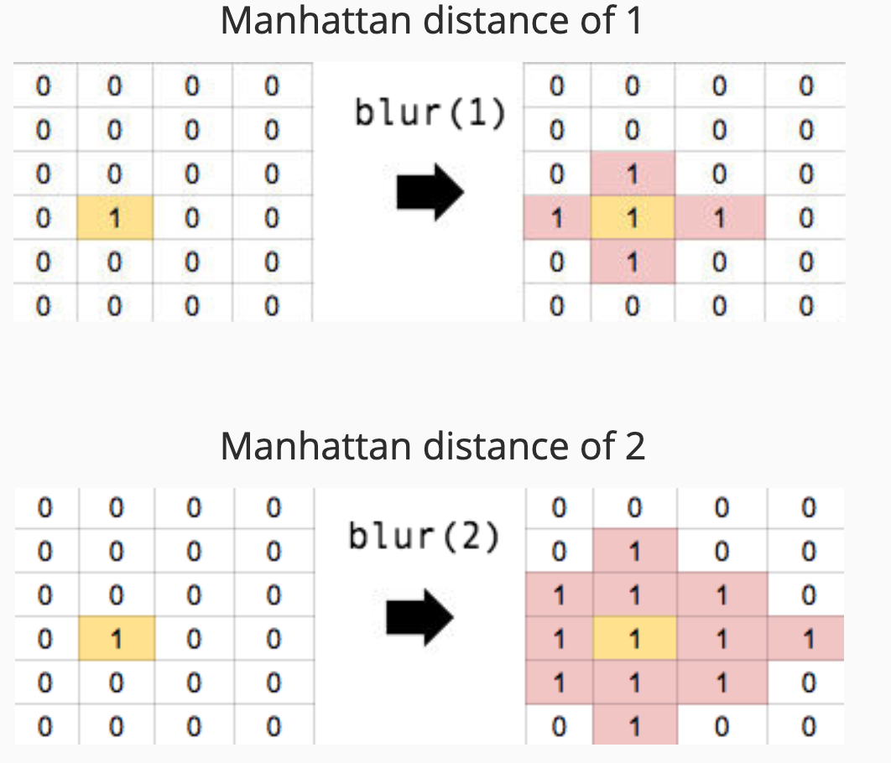
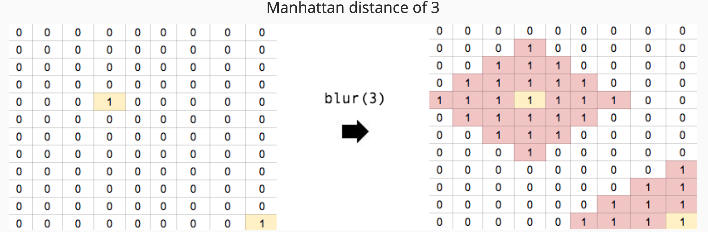

# image_blur_3 Coding Challenge

## Manhattan Distance Image Blur

Given an image, we want to build a method to blur the image. However, instead of only blurring images that are within one pixel, we want to specify how far to blur pixels that are within a [Manhattan Distance](https://www.yourdictionary.com/manhattan-distance) of what is specified. Build the method def blur(distance) that will implement a blurring of the Manhattan distance specified.

In short: you want to find all 1's and turn any pixels that can be reached by making n moves or less using only left, right, up or down from the starting point.

Here are a few examples of images before and after. The only things you'll want your image to reflect are the values of 0's and 1's. Orange 1's represent pixels that were 1's before the transformation, and pink indicates pixels that changed color due to the transformation.

It’s acceptable to either build a new image, or mutate the existing image inline.

Modify your existing blur solution to accept a Manhattan distance and allow users to perform this more advanced transformation.

## The Solution

Here is **[my solution](image_blur_3.rb)**.
